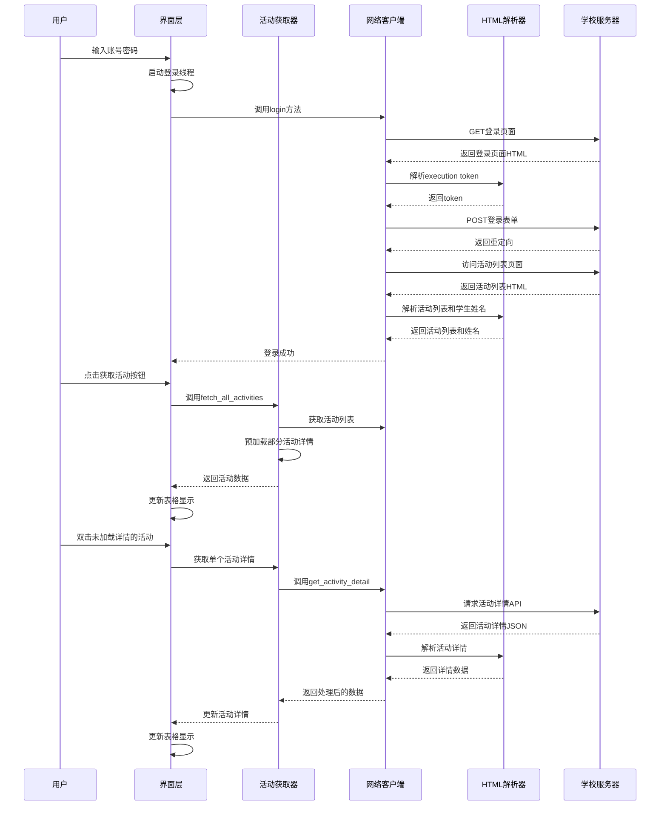

# 中国石油大学第二课堂活动查询助手技术原理文档

## 1. 项目概述

中国石油大学第二课堂活动查询助手（CUP 2nd Class Helper）是一个专为中国石油大学学生设计的桌面应用程序，用于高效查询和管理第二课堂活动信息。该应用提供了直观的用户界面，帮助学生快速查看已报名活动、签到状态、活动详情等重要信息。

### 1.1 核心功能
- 学生账号登录认证
- 活动列表获取与展示
- 活动详情信息查询（签到状态、时间、积分等）
- 活动状态可视化（通过颜色区分完成/未完成活动）
- 学生姓名个性化显示

### 1.2 技术栈
- **编程语言**: Python 3.x
- **GUI框架**: Tkinter
- **网络请求**: Requests
- **HTML解析**: BeautifulSoup4
- **终端输出美化**: Colorama

## 2. 系统架构设计

### 2.1 整体架构

```
+-------------------+       +------------------+       +-------------------+
|                   |       |                  |       |                   |
|    UI层 (tkinter)  |<----->|  业务逻辑层      |<----->|  数据处理层       |
|                   |       |                  |       |                   |
+-------------------+       +------------------+       +-------------------+
         ^                          ^                          ^
         |                          |                          |
         v                          v                          v
+-------------------+       +------------------+       +-------------------+
|                   |       |                  |       |                   |
|  main_app.py      |       | activity_fetcher.py|       | network_client.py|
|                   |       |                  |       |                   |
+-------------------+       +------------------+       +-------------------+
         ^                          ^                          ^
         |                          |                          |
         v                          v                          v
+-------------------+       +------------------+       +-------------------+
|                   |       |                  |       |                   |
|   ui_manager.py   |       | html_parser.py   |       |   config.py       |
|                   |       |                  |       |                   |
+-------------------+       +------------------+       +-------------------+
```

### 2.2 分层设计说明

系统采用清晰的分层架构，将不同功能模块解耦，便于维护和扩展：

1. **UI层**：负责用户界面的展示和交互，由`main_app.py`和`ui_manager.py`共同实现
2. **业务逻辑层**：处理核心业务逻辑，如活动数据获取、详情加载等，主要由`activity_fetcher.py`实现
3. **数据处理层**：负责网络请求、数据解析和配置管理，由`network_client.py`、`html_parser.py`和`config.py`实现

## 3. 核心模块详细说明

### 3.1 用户界面模块 (UI)

#### 3.1.1 ActivityViewer类

`ActivityViewer`是应用程序的主类，继承自Tkinter的`Tk`类，负责初始化和管理整个应用界面。

**主要功能**：
- 界面组件初始化（登录框、按钮、Treeview等）
- 事件绑定和处理（登录、数据获取、双击加载详情等）
- 线程管理（登录线程、数据获取线程）
- 状态管理（登录状态、活动数据缓存）

**关键方法**：
- `perform_login()`：处理登录逻辑，启动登录线程
- `start_data_fetch()`：启动活动数据获取流程
- `fetch_detail_on_double_click()`：处理双击事件，加载单个活动详情

#### 3.1.2 UIManager类

`UIManager`类负责UI界面的具体管理，包括Treeview样式配置、状态栏更新、按钮状态控制等。

**主要功能**：
- Treeview标签样式配置（为完成/未完成活动设置不同颜色）
- 状态栏消息更新
- 按钮状态管理（禁用/启用）
- 表格数据更新和清空
- 错误和警告消息框显示

**关键方法**：
- `_setup_tree_tags()`：设置Treeview的标签样式
- `update_tree()`：更新Treeview表格内容
- `update_status()`：更新状态栏消息

### 3.2 活动数据获取模块

#### 3.2.1 ActivityFetcher类

`ActivityFetcher`类负责活动数据的获取和处理，是业务逻辑层的核心。

**主要功能**：
- 获取所有活动列表
- 预加载指定数量的活动详情
- 获取单个活动的详细信息
- 数据缓存管理

**关键方法**：
- `fetch_all_activities()`：获取所有活动并预加载部分详情
- `fetch_single_activity_detail()`：获取单个活动的详细信息

#### 3.2.2 ActivityFetcherThread类

`ActivityFetcherThread`类负责在独立线程中执行活动数据获取操作，避免阻塞UI线程。

**主要功能**：
- 管理数据获取线程
- 提供回调机制通知主线程进度和结果
- 处理异常并通过回调返回

**关键方法**：
- `start()`：启动数据获取线程
- `_fetch_all_thread()`：获取所有活动的线程函数
- `_fetch_single_thread()`：获取单个活动详情的线程函数

### 3.3 网络请求模块

#### 3.3.1 ApiClient类

`ApiClient`类封装了与中国石油大学第二课堂系统的所有网络交互。

**主要功能**：
- 会话管理（使用requests.Session保持登录状态）
- 登录认证处理
- 活动列表页面获取
- 活动详情API请求
- 学生姓名提取和存储

**关键方法**：
- `login()`：执行登录逻辑，处理CAS认证流程
- `get_activity_list()`：获取活动列表页面
- `get_activity_detail()`：获取单个活动的详细信息
- `get_student_name()`：获取学生姓名

### 3.4 数据解析模块

#### 3.4.1 HTML解析函数

`html_parser.py`模块提供了一组函数，用于解析HTML页面和JSON数据，提取所需信息。

**主要功能**：
- 从登录页面解析execution token
- 从活动列表页面解析学生姓名
- 从活动列表页面提取活动列表
- 解析活动详情JSON数据

**关键函数**：
- `parse_execution()`：解析登录token
- `parse_student_name()`：解析学生姓名
- `parse_activity_list()`：解析活动列表
- `parse_activity_detail()`：解析活动详情

### 3.5 配置管理模块

`config.py`模块集中管理应用程序的配置信息，便于统一修改和维护。

**主要配置项**：
- 系统URL（登录URL、服务URL、活动列表URL等）
- HTTP请求头配置
- 预加载详情数量限制

## 4. 核心技术实现细节

### 4.1 CAS单点登录实现

应用程序实现了CAS（Central Authentication Service）单点登录协议，用于与学校的认证系统交互。

**实现流程**：
1. 获取登录页面，解析execution token
2. 构建登录表单数据，包含用户名、密码和execution token
3. 提交登录请求，处理302重定向
4. 验证登录状态

```python
# CAS登录核心流程
def login(self, username: str, password: str):
    # 1. 获取登录页面，解析execution token
    login_page_resp = self.session.get(config.LOGIN_URL, params={'service': config.SERVICE_URL})
    execution = html_parser.parse_execution(login_page_resp.text)

    # 2. 构建并提交登录表单
    payload = {
        'username': username,
        'password': password,
        'execution': execution,
        # 其他必要参数
    }
    login_resp = self.session.post(config.LOGIN_URL, data=payload, allow_redirects=False)

    # 3. 处理重定向和验证
    # ...
```

### 4.2 多线程数据处理

为了避免在获取大量活动数据时阻塞UI线程，应用程序采用了多线程技术。

**实现细节**：
- 使用Python的`threading.Thread`创建工作线程
- 实现回调机制，在子线程中通过回调函数通知主线程进度和结果
- 在主线程中使用Tkinter的`after()`方法安全地更新UI

```python
# 多线程数据获取示例
class ActivityFetcherThread:
    def start(self, detail_url=None, index=None, on_complete=None, on_update=None):
        if detail_url:
            # 启动获取单个详情的线程
            self.thread = threading.Thread(
                target=self._fetch_single_thread,
                args=(detail_url, index, on_complete, on_update)
            )
        else:
            # 启动获取所有活动的线程
            self.thread = threading.Thread(
                target=self._fetch_all_thread,
                args=(on_complete, on_update)
            )
        self.thread.daemon = True
        self.thread.start()
```

### 4.3 Treeview表格样式与数据可视化

应用程序使用Tkinter的Treeview组件展示活动列表，并通过标签样式实现数据可视化，根据活动状态显示不同颜色。

**实现细节**：
- 使用`tag_configure`定义不同状态的样式（已完成：浅绿色，未完成：浅粉色）
- 在更新表格时，根据活动状态动态应用相应的标签
- 实现表格数据的动态排序（按活动时间倒序）

```python
# Treeview标签样式配置
def _setup_tree_tags(self):
    self.tree.tag_configure("Completed", background="light green", foreground="black")
    self.tree.tag_configure("Incomplete", background="#FFC0CB", foreground="black")
    self.tree.tag_configure("Unknown", foreground="gray")
```

## 5. 数据流程分析

### 5.1 完整数据流程



### 5.2 数据结构设计

#### 活动数据结构

```python
activity_data = {
    'name': '活动名称',  # 活动名称
    'url': '活动详情URL',  # 活动详情页面URL
    'time': '2024-01-01 14:00',  # 活动时间
    'acttime_timestamp': 1704064800,  # 活动时间戳（用于排序）
    'duration': '2 小时',  # 持续时间
    'points': '2',  # 积分
    'tags': ['学术报告', '讲座'],  # 标签
    'signin': '已签到',  # 签到状态
    'signout': '已签退',  # 签退状态
    'is_loaded': True  # 是否已加载详情
}
```

## 6. 技术难点与解决方案

### 6.1 CAS认证流程处理

**难点**：学校系统使用CAS认证，需要处理execution token提取、表单提交和重定向等复杂流程。

**解决方案**：
- 模拟浏览器行为，先获取登录页面提取execution token
- 构建完整的登录表单数据
- 禁用自动重定向，手动处理重定向逻辑
- 验证登录后的会话状态

### 6.2 HTML解析与数据提取

**难点**：需要从HTML页面中准确提取学生姓名、活动列表等信息，HTML结构可能会变化。

**解决方案**：
- 使用BeautifulSoup4库进行HTML解析
- 实现多种姓名提取方法，提高鲁棒性：
  1. 从特定CSS类选择器定位（`div.my_name div.name`）
  2. 使用正则表达式匹配（`(.+?)同学`模式）
  3. 搜索个人信息区域中的可能姓名
- 优先使用CSS选择器，在选择器失败时回退到正则表达式

### 6.3 异步数据加载与UI响应

**难点**：获取大量活动数据可能耗时较长，需要避免UI卡顿。

**解决方案**：
- 实现多线程数据获取机制
- 使用回调函数通知主线程进度和结果
- 使用Tkinter的`after()`方法安全更新UI
- 实现预加载策略，只预先加载最近的N个活动详情
- 支持按需加载，用户双击未加载详情的活动时才获取详情

### 6.4 表格数据可视化与动态更新

**难点**：需要根据活动状态动态显示不同颜色，并在数据更新时保持良好的用户体验。

**解决方案**：
- 使用Treeview的标签样式系统实现条件样式
- 在数据更新时使用渐进式加载，避免一次性清空重绘
- 实现数据缓存和排序机制，确保表格数据的一致性

## 7. 安全性考虑

### 7.1 密码安全

- 不在日志中记录用户密码
- 使用Tkinter的`show="*"`属性隐藏密码输入
- 登录成功后不保存密码，仅维持会话状态

### 7.2 网络安全

- 使用HTTPS协议进行所有网络通信
- 实现会话管理，避免重复登录
- 设置合理的请求头，模拟正常浏览器行为

## 8. 性能优化

### 8.1 数据获取优化

- 实现预加载策略，只预加载最近的N个活动详情
- 使用按需加载机制，用户点击时才获取未加载的详情
- 通过回调函数实现进度反馈，提高用户体验

### 8.2 UI渲染优化

- 批量更新表格数据，减少重绘次数
- 使用标签样式而非逐行设置，提高渲染效率
- 避免在UI线程中执行耗时操作

## 9. 可扩展性设计

### 9.1 模块化架构

系统采用高度模块化的设计，各组件之间通过清晰的接口交互，便于后续扩展：

- `network_client.py`可扩展支持更多API接口
- `html_parser.py`可适应不同的HTML结构变化
- `activity_fetcher.py`可添加更多数据处理功能
- `ui_manager.py`可扩展支持更多UI组件和交互方式

### 9.2 配置管理

通过集中的配置文件管理所有URL和参数，便于适应系统变化：

- 所有URL集中在`config.py`中定义
- 可配置的预加载数量限制
- 可自定义的HTTP请求头

## 10. 总结与展望

中国石油大学第二课堂活动查询助手通过清晰的分层架构、模块化设计和良好的用户体验，为学生提供了便捷的活动查询和管理工具。系统成功实现了多线程数据加载、HTML解析、CAS认证等核心技术点，并通过灵活的设计确保了系统的可维护性和可扩展性。

未来可以考虑的改进方向包括：

1. 添加数据导出功能，支持将活动列表导出为Excel或CSV格式
2. 实现活动提醒功能，在活动开始前提醒用户
3. 优化界面设计，提供更现代的用户体验
4. 添加更多数据统计和分析功能，帮助学生了解参与情况
5. 考虑支持移动端访问，提高使用便捷性

---

*本文档随项目迭代更新，如有疑问请联系开发团队*
